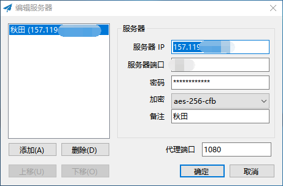
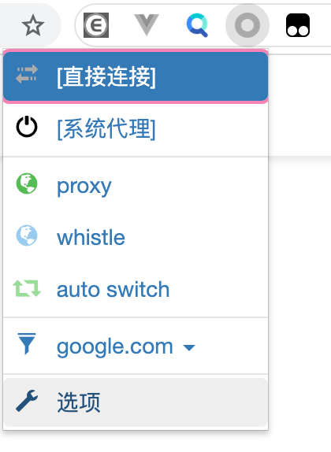

# 梯子部署以及使用方法


## 购买一个境外vps

推荐[搬瓦工](https://bwh81.net/index.php)或者[vultr](https://www.vultr.com/zh/)。「搬瓦工」便宜简单，但是IP容易被封，被封禁后得花钱买IP，一般需要$8.67，血亏。「vultr」配置简单、按小时付费，IP封禁后可直接销毁实例再建一台，但是IP也有不可用的风险。

### Vultr购买指南

1. 注册[vultr](https://www.vultr.com/zh/)账户

2. 新建一个实例[https://my.vultr.com/deploy/](https://my.vultr.com/deploy/)

3. 选择配置并Deploy

选择CloudCompute类型实例，更便宜；尽量选择日本或者美国的服务器，更快一点；操作系统选Ubuntu系列即可；


4. 查看你的实例信息并基础IP地址和密码

## 安装shadowsocks-python服务端

### 进入你的vps服务器中

ssh进入服务器需要你的服务器密码，使用Vultr的话复制实例的密码即可

```bash
ssh root@<YOUR_SERVER_IP>
```

### 下载并安装脚本

```bash
wget --no-check-certificate -O shadowsocks.sh https://raw.githubusercontent.com/teddysun/shadowsocks_install/master/shadowsocks.sh

chmod +x shadowsocks.sh

./shadowsocks.sh 2>&1 | tee shadowsocks.log
```
### 配置脚本

```bash
vi /etc/shadowsocks.json
```

```json
{
    "server":"0.0.0.0",
    "server_port":your_server_port,
    "local_address":"127.0.0.1",
    "local_port":1080,
    "password":"your_password",
    "timeout":300,
    "method":"your_encryption_method",
    "fast_open": false
}
```

### 启动脚本

```bash
启动：/etc/init.d/shadowsocks start
停止：/etc/init.d/shadowsocks stop
重启：/etc/init.d/shadowsocks restart
状态：/etc/init.d/shadowsocks status
```

## 安装shadowsocks客户端

### 下载客户端

根据系统安装[https://github.com/shadowsocks/shadowsocks-windows/releases](https://github.com/shadowsocks/shadowsocks-windows/releases)客户端

### 填写配置

1. 根据服务端的配置填写IP、端口、加密方法



2. 使用全局模式开启shadowsocks，这样即使使用命令行也可以自动匹配代理了


### 浏览器安装代理切换工具

全局代理加载外网有优势，但是国内的网站会较慢，可以使用谷歌的插件来进行代理的切换

1. 使用chrome或者Edge浏览器，在谷歌插件商店找到[Switchy Omega](https://chrome.google.com/webstore/detail/proxy-switchyomega/padekgcemlokbadohgkifijomclgjgif?hl=en)下载并安装。

2. 点击插件并选择选项进入代理配置



3. 新建「情景模式」并代理本地接口，并应用选项。这边使用socks5协议，具体的协议端口可以打开shadowsocks的「偏好设置-高级」中查看


4. 在需要跨网访问的时点击插件并选择建好的情景模式即可代理。

## 参考链接

- [https://www.wangchao.info/1148.html](https://www.wangchao.info/1148.html)
